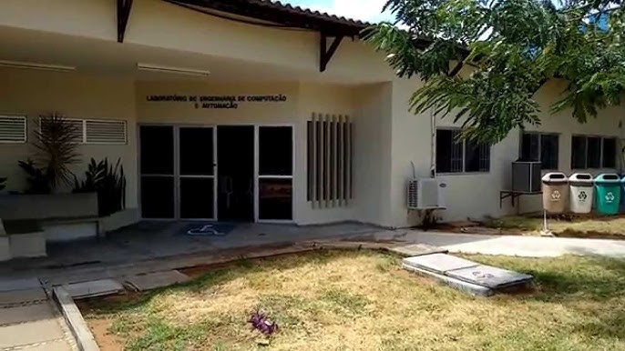

# Análise da Taxa de Reprovação dos Cursos da UFRN com Grafos.

## 📝 Descrição do Projeto

Este projeto tem como finalidade explorar e analisar os dados de matrículas e reprovações em diversos cursos da **Universidade Federal do Rio Grande do Norte (UFRN)**. Utilizando a teoria dos grafos, buscamos modelar a relação entre os cursos e identificar padrões, gargalos e conexões que possam explicar as taxas de reprovação em diferentes áreas, abrangendo desde cursos técnicos e de graduação até pós-graduação (mestrado e doutorado).

---

## 🎯 Objetivo

O principal objetivo é transformar uma grande massa de dados acadêmicos em uma visualização de rede (grafo) que nos permita extrair insights, tais como:
- Identificar os cursos com maiores índices de reprovação.
- Modelar como os cursos se conectam, seja por fluxo de alunos ou correlação acadêmica.
- Visualizar a estrutura da "rede de reprovação" da universidade para encontrar pontos críticos.

---

## 🗂️ Base de Dados

A base de dados utilizada foi construída a partir de fontes públicas de dados da UFRN, consolidando informações sobre matrículas e reprovações em um único dataset.

As colunas abaixo representam uma amostra do dataset final, que exibiu os **19 cursos com o maior número absoluto de reprovações** para uma análise inicial e validação do tratamento dos dados. O dataset completo inclui uma quantidade muito maior de cursos.

As colunas principais são:
- `curso`: Nome do curso.
- `matriculas`: Número total de matrículas no período analisado.
- `reprovacoes`: Número absoluto de reprovações.
- `taxa_reprovacao`: A razão entre o número de reprovações e o de matrículas.

---

## 🛠️ Metodologia

A análise foi conduzida seguindo os seguintes passos:

1.  **Coleta e Tratamento dos Dados:** Extração, limpeza e organização dos dados para criar o dataset principal.
2.  **Modelagem do Grafo:**
    * **Vértices (Nós):** Cada curso da UFRN é representado por um nó no grafo.
3.  **Análise e Visualização:**

---

## 🚀 Tecnologias Utilizadas

- **Linguagem:** Python 3
- **Bibliotecas:**
    - `Pandas` para manipulação e tratamento dos dados.
    - `NetworkX` para a criação, manipulação e estudo da estrutura do grafo.
---

> Projeto desenvolvido para a 1º unidade da disciplina de  Algoritmos e Estrutura de Dados II - DCA/UFRN
